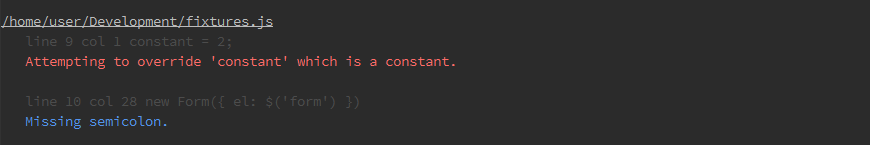
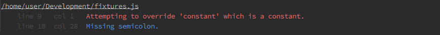
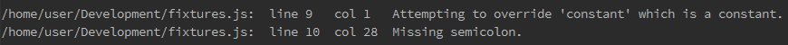

#JSHint-Loader Reporter 

Based on [jshint-stylish](https://github.com/sindresorhus/jshint-stylish) by [sindresorhus](https://github.com/sindresorhus). 
 
## Reporters

#### Default


#### Stylish


#### Compared


## Install
`$ npm install --save-dev jshint-loader-reporter`

## Usage

#### [Webpack](https://webpack.github.io/)

```js
// webpack.config.js 

module.exports = exports = {
  module : {
    preLoaders: [{
      test: /\.js$/,
      exclude: /node_modules/,
      loader: 'jshint'
    }],
  },
  jshint : {
    reporter : require('jshint-loader-reporter')(reporterName)
  }
};
``` 
Where:
  * `reporterName` - (optional) name of reporter (default, stylish or compared)